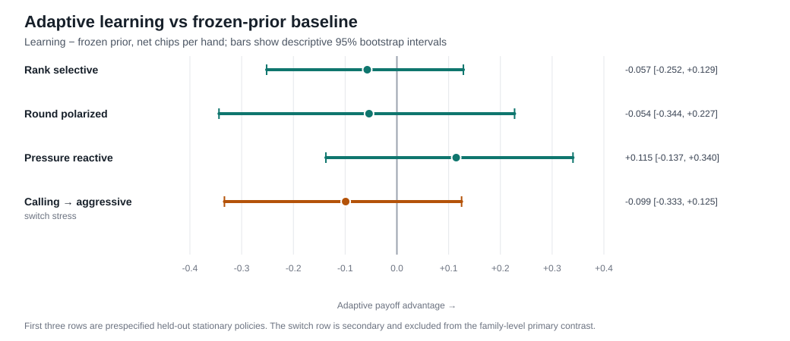

# Adaptive Leduc Poker Research

**Research question:** When does learning an opponent from limited observable behavior improve decisions under partial information, and when does that advantage break down?

This project uses two-player fixed-limit Leduc poker as a small, fully inspectable test bed for adaptive decision-making. A Bayesian learner updates beliefs over opponent policies from legally observable actions, then recomputes an information-set best response. Controlled experiments compare that learner with a **frozen-prior response** that starts from the same initial model but never updates, allowing the value of between-hand learning to be separated from the value of the initial policy itself.

## Key results

- **Primary held-out family result:** across three prespecified opponent policies outside the learner's four-type model, the equally weighted learning-minus-frozen-prior contrast was **+0.0012 net chips/hand**, with a descriptive 95% joint-replicate bootstrap interval of **[-0.1314, +0.1244]**. With this design and sample size, there is **no clear general learning advantage**.
- **Regime-change failure mode:** in the calling-to-aggressive switch stress test, the learning-minus-frozen contrast changed by **-0.6562 chips/hand** from pre-switch to post-switch, with descriptive interval **[-1.0729, -0.2083]**. The learner assumes a fixed opponent type, so an abrupt policy change can make accumulated beliefs harmful.
- **Validation:** the current branch passes **38 automated tests** on clean Python **3.10, 3.12, and 3.13** environments. CI also rebuilds the committed 300-iteration CFR strategy and the follow-up report from source data and checks them against the committed artifacts.



The intervals above are descriptive bootstrap intervals, not multiplicity-adjusted hypothesis tests. The three stationary opponents are constructed stress cases, not a representative sample of human players.

## Why the baseline matters

A central evaluation choice is the comparison against the frozen-prior response.

For the held-out **pressure-reactive** opponent, learning outperformed the fixed CFR policy by **+1.1944 chips/hand** with interval **[+0.6302, +1.7535]**. That number alone could make adaptation look very strong. But the learning-minus-frozen-prior contrast was only **+0.1146 [-0.1372, +0.3403]**.

The difference is important: both the learner and the frozen-prior control begin with the same exact response to the initial opponent mixture. Comparing them isolates the effect of **updating from new observations**, rather than crediting learning for an advantage already present before the first hand.

## System overview

```text
Leduc simulator
    ↓
CFR reference policy
    ↓
legally observable trajectories
    ↓
Bayesian opponent model
    ↓
exact information-set response
    ↓
adaptive vs frozen-prior vs CFR experiment
    ↓
paired evaluation + bootstrap uncertainty
    ↓
failure-mode and provenance checks
```

## Method

### 1. Leduc environment

`pokerlab/game.py` implements the frozen two-player Leduc variant documented in `rules.md`:

- six physical cards: two copies each of J, Q, K;
- one private card per player and one public card after round one;
- fixed bet sizes of 2 and 4 chips;
- two bet/raise actions maximum per round;
- net zero-sum payoffs.

`GameState` contains simulator truth, but policies receive only `PlayerObservation`. The opponent's private card is hidden unless it is legally revealed at showdown.

### 2. CFR reference

`pokerlab/cfr.py` implements full-tree tabular counterfactual regret minimization and exact evaluation for this game. The committed `strategy.json` is the average policy after 300 iterations.

The CFR policy is a **reference policy**, not a claim of exact equilibrium play. Its role is to provide a fixed game-theoretic comparison and the base probabilities used to construct the finite opponent model family.

### 3. Bayesian opponent model

The learner's candidate set contains four prespecified policies:

```text
baseline
folding
calling
aggressive
```

These are modeling assumptions, not fitted behavioral estimates.

After each completed hand, `BayesianOpponentModel` evaluates the likelihood of the legally observed public trajectory under each candidate policy. Hidden opponent cards are marginalized when they are not revealed, and posterior weights are updated in log space.

### 4. Adaptive decision rule

Before the next hand, the adaptive agent computes an exact information-set best response to the posterior mixture of opponent types.

The main control is a **frozen-prior** agent that computes the same response to the same initial uniform prior but never updates it. Therefore:

```text
adaptive − frozen prior
```

is the primary contrast for the incremental value of between-hand opponent learning.

A fixed CFR arm is included as a secondary reference.

## Evaluation design

The main follow-up was fixed in `FOLLOWUP_PROTOCOL.md` before its outcomes were generated.

### Stationary held-out family

Three constructed policies are absent from the learner's candidate model:

- `rank_selective` — behavior depends on private rank and board pairing;
- `round_polarized` — passive before the board, aggressive after it;
- `pressure_reactive` — applies pressure first and backs off after opposing pressure.

Each condition uses:

- **24 independent replicate units**;
- one match in each seat per replicate;
- **12 hands per seat**;
- paired hand seeds across experimental arms;
- 2,000 percentile-bootstrap resamples over replicate units.

The primary statistic averages the learning-minus-frozen contrast across the three held-out conditions before bootstrapping the shared replicate indices.

### Regime-switch stress test

A separate secondary condition changes the opponent from `calling` to `aggressive` before hand 6.

The learner:

- is not told the change point;
- does not reset its posterior;
- still assumes one stationary type generated the observed hands.

This intentionally violates the model assumption and tests how the system behaves under regime change.

## Results

| Condition | Learning | Frozen prior | CFR | Learning − frozen, 95% descriptive interval |
| --- | ---: | ---: | ---: | ---: |
| Rank selective | -0.6181 | -0.5608 | -0.3472 | -0.0573 [-0.2517, +0.1285] |
| Round polarized | -0.2396 | -0.1858 | -0.2795 | -0.0538 [-0.3438, +0.2274] |
| Pressure reactive | +0.9288 | +0.8142 | -0.2656 | +0.1146 [-0.1372, +0.3403] |
| Calling → aggressive | -0.4583 | -0.3594 | -0.4323 | -0.0990 [-0.3333, +0.1250] |

The family-level primary contrast over the first three rows is:

```text
learning − frozen prior = +0.0012 [-0.1314, +0.1244] chips/hand
```

This result does **not** establish that adaptive learning generally improves play. It shows that under this finite candidate model, these three held-out policies, and this data budget, any average advantage is small relative to the measured uncertainty.

For the switch stress condition:

| Phase | Learning − frozen prior |
| --- | ---: |
| Pre-switch | +0.2292 [-0.0521, +0.5312] |
| Post-switch | -0.4271 [-0.7639, -0.0938] |
| Post minus pre | **-0.6562 [-1.0729, -0.2083]** |

This is evidence of a concrete failure mode of the current stationary-type learner; it is not a claim about all non-stationary environments.

## Validation and trustworthiness

The project is designed so that a positive result cannot be trusted solely because a simulation ran without errors.

Current safeguards include:

- **38 automated tests** covering legal actions, round transitions, payoffs, ties, chance-card consistency, hidden-card boundaries, CFR information sets, Bayesian marginalization, posterior updates, opponent switches, seed uniqueness, phase assignment, report provenance, and bootstrap-summary consistency;
- clean-package installation tested on Python **3.10, 3.12, and 3.13**;
- separate random streams for cards and player actions;
- identical exogenous hand seeds across experimental arms within each paired comparison;
- seat swapping within every replicate;
- raw per-hand records saved for every reported experiment;
- SHA-256 hashes tying saved results to `strategy.json`, `rules.md`, protocol files, and relevant source modules;
- report builders that reject missing rows, duplicate seeds, incorrect phase labels, posterior resets at the switch, inconsistent summaries, and source-hash mismatches;
- exact regeneration of the committed 300-iteration CFR strategy in CI;
- regeneration of `FOLLOWUP.md` from committed raw records in CI;
- a 20,000-hand Monte Carlo path check against the exact profile evaluator.

The Monte Carlo evaluator and exact evaluator use different evaluation paths but still share the project's game implementation. **An independently implemented external game-engine cross-check is not currently committed and should not be claimed as completed validation.**

## Failure modes and limitations

The negative and mixed results are part of the project rather than hidden edge cases.

1. **Model misspecification:** the learner chooses among four fixed candidate types, while the primary evaluation opponents are deliberately outside that set.
2. **Regime change:** the posterior assumes one type persists across hands; an abrupt switch can leave the learner confidently adapted to stale behavior.
3. **Prediction is not payoff:** a posterior can become more concentrated without necessarily improving downstream decisions or reward.
4. **Baseline sensitivity:** comparison with CFR alone can attribute value to "learning" that was already present in the initial mixture response.
5. **Finite statistical power:** 24 replicate units still produce broad intervals for several opponent-specific contrasts.
6. **Constructed opponents:** the held-out policies are controlled behavioral rules, not empirical models of human poker players or financial-market participants.
7. **Shared implementation:** simulator and exact evaluator share game logic, so internal agreement is not equivalent to external correctness.

## Reproducing the project

Core code has no third-party runtime dependency.

```bash
python -m pip install -e .
python -m unittest discover -s tests -v
```

Rebuild the deterministic CFR reference:

```bash
python -m pokerlab.cfr --iterations 300 --output /tmp/strategy.json
cmp strategy.json /tmp/strategy.json
```

Revalidate the committed follow-up records and regenerate the report:

```bash
python -m pokerlab.followup --output /tmp/FOLLOWUP.md
cmp FOLLOWUP.md /tmp/FOLLOWUP.md
```

Regenerate the recruiter-facing figure from the same validated records:

```bash
python scripts/make_result_figure.py --output /tmp/adaptive-vs-frozen.svg
cmp results/adaptive-vs-frozen.svg /tmp/adaptive-vs-frozen.svg
```

Run the exact-vs-rollout evaluator check:

```bash
python -m pokerlab.validate --player0 baseline --player1 calling --hands 20000 --seed 7
```

For the full prespecified experiment reproduction, run the **Full experiment reproduction** GitHub Actions workflow or execute the four commands in `FOLLOWUP.md`. Each regenerated raw JSON is compared against its committed record by the workflow.

## Repository structure

```text
pokerlab/
  game.py          Leduc state transitions and observation boundary
  cfr.py           CFR training, exact profile values, best responses
  bayes.py         finite opponent model and Bayesian updates
  experiment.py    paired stationary and switching experiments
  followup.py      prespecified held-out-family validation/reporting
  report.py        historical pilot validation/reporting
  validate.py      exact-vs-simulation evaluator check
  profile.py       deterministic performance profiling

tests/             correctness and experiment-integrity tests
results/           committed raw experiment records and result figure
scripts/           reproducible presentation artifacts
rules.md           frozen game rules
FOLLOWUP_PROTOCOL.md
                   prespecified primary experiment
FOLLOWUP.md         validated current follow-up analysis
REPORT.md           earlier pilot analysis
strategy.json       committed 300-iteration CFR reference
```

## Current status

**Implemented and internally validated**

- Leduc simulator and observation boundary;
- tabular CFR reference and exact evaluator;
- finite Bayesian opponent model;
- exact adaptive mixture response;
- stationary held-out and policy-switch experiments;
- paired bootstrap evaluation;
- provenance and report-integrity checks;
- clean-install CI and reproducible result artifacts.

**Not established**

- a general advantage from opponent learning;
- robustness to arbitrary unseen or changing opponents;
- empirical validity on human poker behavior;
- scalability to Texas Hold'em;
- independent external-engine validation of all game and inference logic.

This is ongoing independent research. The current contribution is the controlled experimental and validation framework, together with a documented result showing both where adaptation can appear valuable and where the same model can break under misspecification or regime change.
